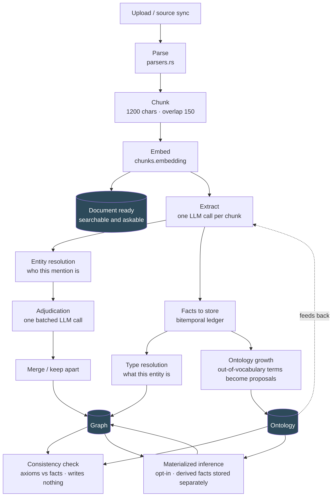
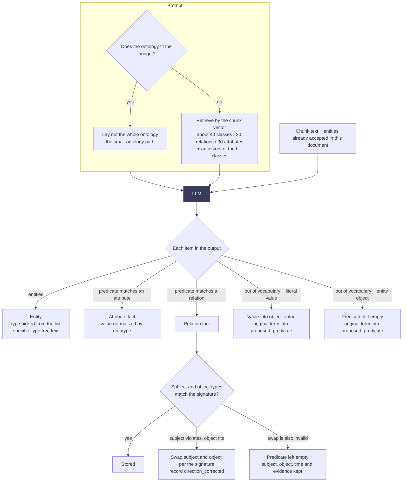
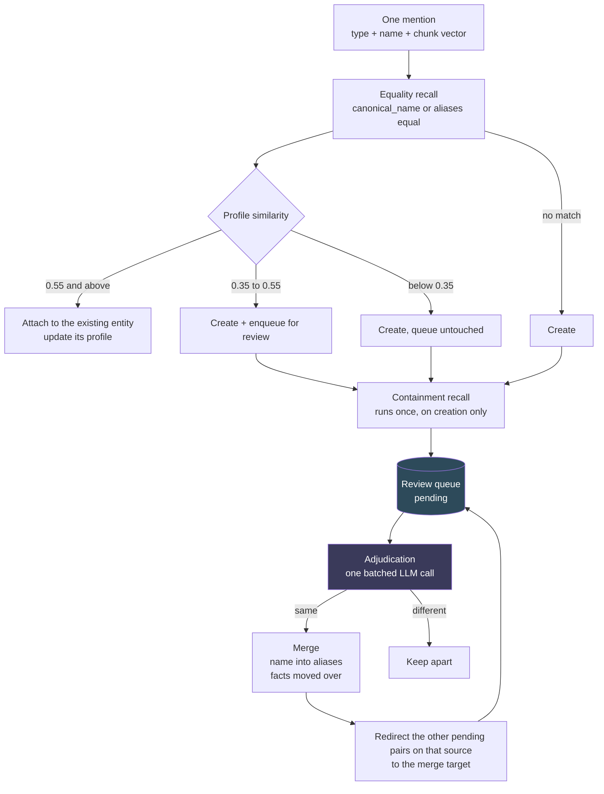
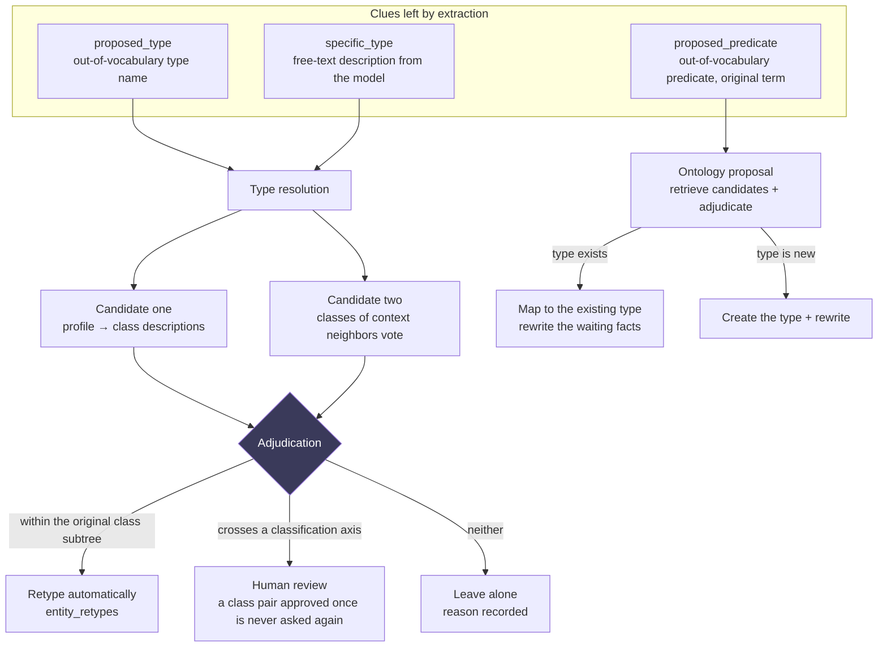
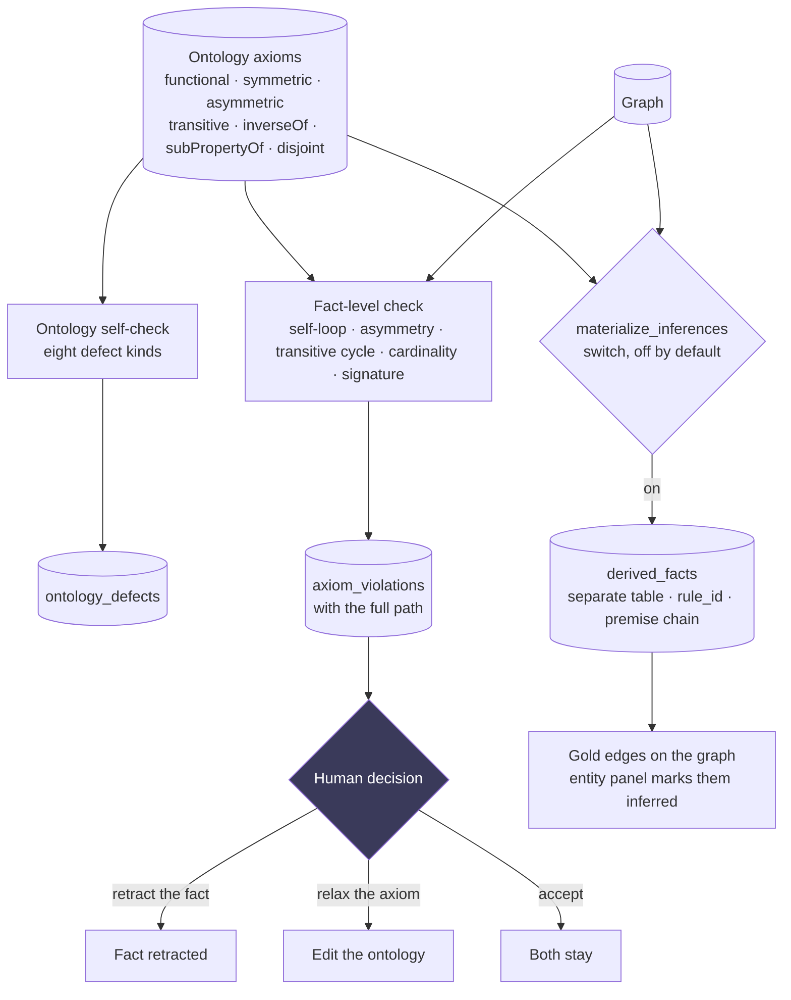

# How a Document Becomes a Graph

**This page describes how a document flows through the pipeline.** The reasons behind each choice live in [decisions/](decisions/README.md). This page answers a different question: **where the line you are editing sits in the chain, what upstream hands it, and what breaks downstream if you hand nothing on.**

> The most valuable thing on the map is **where the arrows break**. Every stage ends with a "Where this stage drops things" section listing the drop points that actually exist in the code and where they land in the database: the kinds you can already count in `extraction_drops`, rather than theoretical failures.

## Overview



**The two-phase split is deliberate.** A document is `ready` as soon as embedding finishes; search and Q&A work immediately while extraction queues in the background. A long document takes minutes to grow its graph but is searchable within seconds.

**The dotted line back into extraction is the loop.** Extraction uses the ontology; when it meets a term the ontology lacks, it records the original wording; proposals flow back into the ontology; the next batch of documents is extracted with it. See [0003](decisions/0003-ontology-growth-loop.md).

**Where the ontology comes from.** A new database seeds nothing. The starting point is an optional prebuilt pack (schema.org, W3C Org, PROV-O, FOAF, IOF Core; none is checked by default), a user-imported OWL file, or nothing at all, which is the default. An empty ontology still extracts; an entity without a type simply has no type. See [0008](decisions/0008-ontology-packs-as-cold-start.md) and [0009](decisions/0009-no-type-is-a-type.md).

**The bottom two boxes are the ontology's axioms at work.** The consistency check never writes `facts`; it only surfaces contradictions (the Review page's two tiers, violations and defects). Materialized inference is off by default; when on, derived facts go to a separate table, show as gold on the graph, and never close any asserted fact. See section 4.

---

## 1. Extracting a Chunk



**`specific_type` is the easiest output to overlook.** Free text, unvalidated, never entered into the ontology: it is the model's own description of the entity ("vector database software"). Type resolution uses it to turn the task from "understand what this is" into "which class in the ontology has this name". Without it, a test run left `proposed_type` empty on all 17 entities: the list always has something close enough, the model picks it, and the more precise description is lost.

**Neither out-of-vocabulary path loses anything.** A literal value goes to `object_value` instead of becoming an entity named "2015". An entity object leaves the **predicate empty** instead of degrading into a relation called "related to", which would be an assertion rather than vagueness ([0010](decisions/0010-no-relation-is-no-relation.md)). In both cases the original term goes to `fact_evidence.proposed_predicate`, the one place on the fact that still carries the original meaning; `fact_surface_predicate()` reads it back for display.

**A matched relation still passes a signature check.** The ontology declares `employee (organization → person)`, and the model still writes `Musk employee Microsoft`; three rounds of prompt tuning could not suppress it, because English "X is an employee of Y" is too strong. So the write path corrects it: if the subject violates the domain and the object fits, swap them and record `direction_corrected`, never silently. If the swap is also invalid (`OpenAI affectedBy …`, a medical-test predicate in schema.org), drop the predicate and keep subject, object and evidence. Argument order is an encoding convention of the key, not a claim about the world, so here the ontology enforces. See [0012](decisions/0012-the-ontology-is-a-contract-not-a-suggestion.md).

### Where this stage drops things

Eleven reason codes, all recorded in `extraction_drops` and visible in the UI (one is a trace, not a drop):

| Reason | When |
|---|---|
| `truncated_reply` | The model's output was cut off; the whole chunk is discarded |
| `malformed_item` | One fact is malformed; **only that item** is dropped, not the chunk (#127) |
| `not_an_entity_name` | The "entity name" is a whole sentence (judged by word count and finite verbs, #143) |
| `low_confidence` | The model's self-reported confidence is below the threshold |
| `subject_not_declared` | The subject is not declared in `entities`; recorded on **both** the relation and attribute paths |
| `attr_domain_mismatch` | The attribute is attached to a class outside its domain, even after walking up the parent DAG |
| `attr_no_value` / `attr_datatype` | The attribute fact has no value, or the value cannot be converted to the declared datatype |
| `object_missing` | The relation fact has no object |
| `direction_corrected` | **Not a drop**: subject and object were swapped per the signature; recorded so it is never silent |
| `domain_mismatch` | The swap is also invalid; the predicate is dropped (subject, object and evidence stay) |

**`attr_domain_mismatch` is the most expensive.** It drops the fact at write time, and retyping the entity later does not recover it: the fact was never written and can only be re-extracted.

---

## 2. Entity Resolution: Who This Mention Is



**Two thresholds, three tiers** (`SIM_ATTACH = 0.55`, `SIM_NEW = 0.35`): clearly the same attaches; suspiciously similar creates a new entity and queues it; dissimilar creates one without touching the queue. **Prefer splitting over merging.** A wrong merge mixes two entities' facts together, which costs far more than one extra entity.

**Containment recall** (`Holmes` ⊂ `Sherlock Holmes`) covers the blind spot of equality recall: prefixes cannot be enumerated, so a short name would silently become a second entity. Three constraints: the shorter name is at least 4 characters (below that it is usually a generic word), at most 4 pairs per run, and SQL scans 16 extra rows because hard-disjoint types are only filtered on the Rust side.

**The redirect step** is the least intuitive part of the graph and the easiest to delete by mistake. After a merge, the other pending pairs that involve the merged-away entity **must not be closed**; they are redirected to the merge target. The reason follows.

### Three Holes, One Corpus

Four runs over the first six stories of *The Adventures of Sherlock Holmes* (`scripts/bench/corpora/holmes.json`), each fixing one layer:

| | Baseline | Same-type fix | Alias recall | Redirect |
|---|---|---|---|---|
| Entities merged | 14 | 37 | 47 | **57** |
| `Holmes` merged | ✗ | ✓ | ✓ | ✓ |
| `Mr. Holmes` merged | ✗ | ✗ | ✗ | **✓** |

**Layer one.** `classify_type_drift` had no tier for "both types equal", so `person × person` fell into `Disjoint`, "can never be the same". The function was written for type drift (one name extracted as two types), where equal sides never occur; containment recall later borrowed it as a compatibility test, where equal sides are the norm. The most obvious coreferences in the text never reached the queue, and all twelve existing unit tests covered cross-type cases.

**Layer two.** Recall looked only at `canonical_name`. A merge moves the name into `aliases`, so every successful merge removed a bridge: once `Holmes` was merged, the later `Mr. Holmes` and `Sherlock Holmes` contained neither the other, and `Holmes` had been the bridge. Fixing layer one exposed layer two.

**Layer three.** A merge closed the other pending reviews involving the merged-away entity as `superseded by merge`; the code comment claimed a later mention would raise the doubt again. That was wrong: containment recall runs only when an entity is created, and these entities already exist, so closing was permanent. Now they are redirected to the merge target, and only two genuinely stale kinds are closed: pairs that become self-loops after the redirect, and pairs whose target pair is already queued.

**Each layer hid the next.** The value of the benchmark corpus is the next layer it exposes after every fix, more than the first number it produces.

### Where this stage drops things

No facts are lost, but **entities that belong together can stay apart**. Two known gaps:

- Two names that neither contain each other nor share an alias as a bridge (`启明 X7 加速卡` vs `启明 X7 推理加速卡`). Trigram similarity would cover this, but `CREATE EXTENSION pg_trgm` needs superuser and this repository connects with a restricted role.
- Containment recall is capped at 4 pairs per run. A generic name may be contained by dozens of entities, and admitting them all would flood the queue.

A merge itself is **reversible**: `entity_merges` records everything as it was, and `revert_merge` restores it.

---

## 3. Type Resolution: What This Entity Is



**The two candidate routes are unioned, never scored together.** Distances are incomparable in three places: across entities (`清华大学计算机系→computer_store` at 0.46 is closer than `星云科技→corporation` at 0.59, and the former is absurd), between the two routes (one lives in class space, the other in entity space), and between two queries on the same route (a short query like "医药集团" yields systematically smaller distances than a full profile). Candidates are interleaved instead.

**Tiering ignores the model's self-reported confidence.** In practice it is bimodal (15 items all ≥ 0.85, 4 null, nothing in between): it is tone, not probability. The tier comes from whether the chosen class sits in the original class's subtree. Inside means one step down, applied automatically; outside means a different classification axis, sent to a human.

**Corrections go to a human as well, by construction.** Extraction already picks fine-grained classes after per-chunk retrieval, and sometimes picks wrong ones (`绍兴 → address`). The right answer is a **sibling** of the wrong class, so it always reads as crossing an axis. Overturning extraction's judgment is riskier than refining it and should not happen automatically.

### Where this stage drops things

No facts are lost. A retype is one UPDATE on `entities` plus a row in `entity_retypes`, and entity history shows it as `retyped` / `retype_reverted` events. **Reversible does not mean it will be reversed**, which is why preview comes before apply.

**Type resolution runs only by hand today**: preview → apply on the ontology page, with no automatic trigger. Finishing extraction only enqueues ontology growth and entity adjudication, so refining new entities under a large ontology depends on someone remembering to click. This is a real gap (0001 P3a).

**Human decisions are never re-judged by the engine.** Entities whose `entities.type_source` is `human` are excluded from the candidate pool, including "a human decided it has no type" (0001 P4a).

**Rejections carry a reason.** The design bets on "none of these" being an honest answer, which made `left_alone` the largest and most opaque tier while it was only a count. With reasons recorded, the first run answered a question that had been unanswerable: the failures were **all on the retrieval side** (`administrative_area` and `periodical` were never offered), none in adjudication.

---

## 4. Axioms: Checking and Inference



**Signatures count on all three write paths** (#190 / #196). The "do subject and object match the signature" check from section 1 lives in the store (`ontology::judge_direction`). Extraction calls it when writing new facts. Adoption calls it when reattaching a predicate to old facts; where both directions fail, the predicate is **not attached** and the count is reported as `facts_left_off`. A merge that changes subject or object neither swaps nor edits; it re-checks only the moved facts, and violations go to `axiom_violations` as `signature`. The `signature` check kind is the full-scan version of the same rule, so a domain changed in the ontology after the fact is caught too.

**The check writes nothing; inference writes to a separate table.** The consistency check (R0) only points at problems, with zero risk. Materialized inference (R1) adds to the graph, so each of its constraints is necessary: rules **compile only from ontology axioms**, with no user DSL; **asserted facts strictly override derived ones**, so a triple already asserted is never derived and "who said this" has one answer; a depth limit plus cycle detection, a cap of 20,000 per predicate, and truncation **is reported**; valid time is the intersection of the premises, and an empty intersection derives nothing. Derived facts never enter `facts`: of the forty-odd queries that read `facts`, only one recognizes a marker, so with separate tables a forgotten UNION makes derived facts **invisible** rather than **mixed in**.

**The ontology self-check runs first.** A self-contradictory ontology (a relation both symmetric and asymmetric, a subclass cycle, an inverse that does not point back) makes every fact-level conclusion suspect.

**A database without an ontology pack reports zero.** That is the truth, not a fault: without axioms there is no criterion, and reporting no contradiction is safer than guessing an axiom.

**When it runs.** The check runs automatically after an ontology import (the axioms just changed, the best moment to recompute) and on demand from the Review page. Inference reruns in full on a timer, `inference_interval_minutes` (default 60); incremental maintenance is not built yet.

### Where this stage drops things

Nothing is dropped, but the engine keeps quiet in two places. A derivation that contradicts an assertion (or another derivation) is not written; since #238 it leaves an `axiom_violations` row of kind `derived_contradiction`, capped per predicate, with the overflow counted in the run report and rule-versus-rule disagreements recorded as `ontology_defects` (`rules_disagree`) — see [0017](decisions/0017-a-contradiction-points-upstream.md). When one triple has several derivation paths, only the first proof is kept; that one is still silent ([0002](decisions/0002-reasoning-engine.md)).

## Running the Benchmarks

`scripts/bench/` is a rerunnable measurement bench, **one fresh database per run**. Reusing a database saves minutes and costs a whole run of invalid conclusions; that is a lesson learned, not a hypothesis.

```bash
node scripts/bench/run.mjs --corpus pharma --label seeds-only
node scripts/bench/run.mjs --corpus holmes --label holmes
```

Three corpora measure three things, with different requirements:

| Corpus | Measures | Answer key |
|---|---|---|
| `tech` / `pharma` | Type accuracy | Yes (weak: hand-written) |
| `holmes` | Entity resolution · demo footage | **None, by design** |

The Holmes corpus **must not** have an accuracy key: the model has read the book, so measuring type accuracy would measure memory, not the pipeline. A fabricated answer key is worse than no score.

## Related Decisions

- [0001](decisions/0001-ontology-import-and-governance.md) Ontology import and governance, with the measured revision of P3
- [0003](decisions/0003-ontology-growth-loop.md) Growing the ontology from the corpus, and where the human stands in the loop
- [0006](decisions/0006-ontology-scale-and-the-prompt.md) Ontology scale and the extraction prompt, with the curve and one reversal
- [0002](decisions/0002-reasoning-engine.md) Reasoning engine order and safety boundary; [0012](decisions/0012-the-ontology-is-a-contract-not-a-suggestion.md) direction correction at write time
- [0017](decisions/0017-a-contradiction-points-upstream.md) A contradiction points at an error upstream: what happens when a derivation disagrees with the ledger
- [0009](decisions/0009-no-type-is-a-type.md) / [0010](decisions/0010-no-relation-is-no-relation.md) An undecided type and an unnamed relation both stay empty
